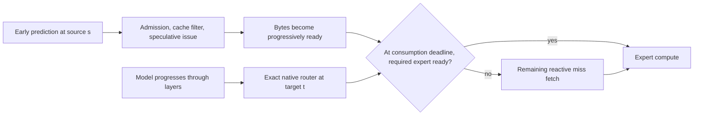

# Lecture: what we learned about predictive MoE prefetching

**Session covered:** 15–16 September 2026 continuation

**Audience:** an engineer who wants to understand the design, the experiments, the evidence boundaries, and the implementation choices well enough to reproduce or challenge them.

This lecture explains the work completed in this continuation session. Here **end-to-end (E2E)** means the complete token workload, **least-recently-used (LRU)** means the reactive residency baseline, and **inter-token latency (ITL)** means the measured time per generated token. It begins with a short Qwen3 closeout from the first part of the session, then focuses on the Qwen3.5 and Qwen3.8 predictor and hardware expansion. The central result is deliberately modest: the predictors improve offline route quality, but the measured Qwen3.5 E2E workload shows no E2E LRU speed win. Qwen3.8 has useful head, cache-replay, and transfer evidence, while whole-model E2E is unsupported by the current single-GPU harness.

## Contents

1. [The question](#the-question)
2. [A short chronology](#a-short-chronology)
3. [MoE routing and the prediction problem](#moe-routing-and-the-prediction-problem)
4. [The timing pipeline](#the-timing-pipeline)
5. [Metrics and why they are separate](#metrics-and-why-they-are-separate)
6. [Predictor families and equations](#predictor-families-and-equations)
7. [Low-rank correction, step by step](#low-rank-correction-step-by-step)
8. [Model geometry and selected configurations](#model-geometry-and-selected-configurations)
9. [Offline results](#offline-results)
10. [Hardware and transfer measurements](#hardware-and-transfer-measurements)
11. [Qwen3.5 end-to-end results](#qwen35-end-to-end-results)
12. [Engineering repairs and reproducibility](#engineering-repairs-and-reproducibility)
13. [What the results mean](#what-the-results-mean)
14. [Unexecuted next experiments](#unexecuted-next-experiments)
15. [Glossary](#glossary)
16. [Source map](#source-map)
17. [Self-check questions](#self-check-questions)

## The question

Mixture-of-Experts (MoE) language models contain many expert feed-forward networks, but route each token to only a small native set. Let `E` be the number of experts and `K` the native router's top-k. A token in Qwen3.5, for example, chooses `K=8` experts from `E=256`. The inactive experts may live in host memory or another tier, so the runtime would like to transfer likely future experts while the GPU is doing useful work.

The proposal has two possible sources of advantage:

* **Prediction:** identify future expert IDs before the native router reaches that layer.
* **Lead time:** issue their transfers early enough that the bytes arrive before the expert is consumed.

Those are different problems. A predictor can be statistically accurate and still lose if its score costs more time than the transfer slack it creates. Conversely, a weak signal with a whole-token lead may be more useful than a stronger signal available only a few microseconds before use. The session therefore measured route quality, predictor cost, cache traffic, transfer behavior, and end-to-end token time as separate quantities.

## A short chronology

The first part of this continuation closed the earlier Qwen3 experiment. In the banked run `20260916T015147Z-e2e-qwen3-drift-a-08d6e1a088`, model `Qwen/Qwen3-30B-A3B-Instruct-2507` was pinned to revision `0d7cf23991f47feeb3a57ecb4c9cee8ea4a17bfe`. Native routing was top-8, the residency cache was 32 experts, and the corrected arm used rank-32 `augmented_rows` correction at source layers 20–46 (27 layers); 20 earlier source layers kept the incumbent.

On that workload, the router arm averaged 42.049 ms/token, the corrected arm 41.947 ms/token, and the reactive LRU arm 48.917 ms/token. The corrected-minus-router effect was −0.246%, with a 95% interval of [−1.712%, +1.220%] over three request means. Thus the experiment supports a large LRU-versus-router difference on its own workload, but it does not establish a confident incremental predictor speedup. The historical closeout is in [`report.md`](../../research/results/predictor_hardware_20260915/report.md), with the earlier email receipt in [`predictor_hardware_email_receipt_20260916.json`](../../tools/predictor_hardware_email_receipt_20260916.json). Its email ID is distinct from the final Qwen3.5/Qwen3.8 email sent later at 15:39:39 UTC.

The main work then expanded the evidence ladder. We used a request-held-out Qwen3.5 capture to fit and select correction artifacts, replayed Qwen3.8 carrier and mixer variants, measured predictor heads on an H100, confirmed transfer-copy behavior, and ran three Qwen3.5 E2E breadth settings (`M=8,12,16`). The final generated report is [`qwen35_qwen38_final_report.md`](../../research/results/predictor_hardware_20260915/qwen35_qwen38_final_report.md).

## MoE routing and the prediction problem

At a target layer `t`, the native router receives a hidden state `h_t` and computes one score per expert. In a simplified notation, the router score vector is

```text
z_t = W_t h_t,       z_t in R^E
```

The native route is the IDs of the largest `K` entries of `z_t`, together with the router's normalized weights. Prefetching does not change this decision. The native router remains the authority at the point of consumption; speculation only proposes bytes to stage early.

Suppose a source layer `s` is used to predict a later target layer `t`. The deployed zero-extra-state anchor computes

```text
A = W_t h_s.
```

The exact target score differs by the residual increment

```text
d = W_t (h_t - h_s),
z_t = A + d.
```

This decomposition is the key to the predictor work. Cross-layer predictors can see `A`, but the unseen increment `d` is where their error lives. A method can therefore be improved by estimating a useful component of `d`, provided the estimate transfers from training requests to held-out requests and its compute fits the lead-time budget.

### K versus M

`K` is the native number of experts actually consumed by the model. `M` is the proposed candidate breadth. It is the size of the shortlist offered to admission and cache filtering; it is not necessarily the number of transfers that reach the backend. Resident experts, duplicate IDs, byte budgets, and slack admission can reduce actual issues below `M`. When `M=K`, the proposed set must be exactly right to contain the complete native set. Increasing `M` raises the chance of covering all native experts, but can increase admitted bytes and lower candidate precision.

For Qwen3.8, native truth is top-10 (`K=10`). Therefore candidate full-set coverage at `M=8` is mathematically zero: eight IDs cannot contain ten distinct native IDs. This does not mean an M=8 predictor covers no cache misses. Cache-aware recall is a different question because some native experts may already be resident. The report keeps these measures separate.

## The timing pipeline

The runtime sequence is easiest to understand as a timeline. This is a conceptual sequence; the exact overlap depends on the backend and readiness state.



The exact router and native weights are untouched. “Predicted” means an ID was proposed; “ready” means the required bytes had arrived in the usable layout and synchronization state by the expert-consumption deadline. The native router does not wait for speculative bytes: model progress and speculation proceed independently, and a transfer that arrives after the router but before expert consumption can still help. A predicted expert can be too late, partially ready, evicted, or unnecessary. The implementation tracks readiness separately from prediction so a high recall number cannot be mistaken for hidden transfer time.

The available lead may be one layer, several layers, or a whole token. A later source layer has better state but less time; an earlier source has more time but a less faithful state. This is why the session ranked methods by lead and measured each target layer rather than collapsing all layers into one predictor score.

## Metrics and why they are separate

The main route metrics are:

* **Recall@M:** fraction of native expert IDs present in the candidate set. For native top-k, `recall = |C_M ∩ T_K| / K`.
* **Candidate precision:** fraction of proposed candidates that are native IDs, `|C_M ∩ T_K| / M`. Admission and resident filtering can make actual issues smaller than the proposed breadth; the offline precision definition is based on the proposed set.
* **Full-set coverage:** probability that all native IDs are contained, `P(T_K ⊆ C_M)`. This is stricter than recall.
* **Cache-aware miss coverage:** fraction of experts absent from the current resident cache that are correctly proposed and admitted early. This is the metric closest to avoiding reactive fetches.
* **Issues and waste:** candidate issues per layer and issues that do not cover a cache miss. Waste can rise even when recall rises.
* **Readiness:** whether an issued block has arrived sufficiently by the expert-consumption deadline. A candidate that arrives after that deadline is a miss for latency purposes; arrival after the exact route but before consumption can still help.
* **Traffic ratio:** the final report uses `(candidate issues + remaining reactive misses) / matched reactive misses`. A ratio below one would mean fewer total expert transfers than the matched reactive baseline. Recall alone cannot tell us this.

For example, an M=16 method can have 95% recall while admitting many extra experts. An M=8 method can have lower recall but cover a useful fraction of the native set with fewer proposed bytes. The report therefore places quality and traffic beside each other and does not convert offline quality into an unmeasured speedup.

## Predictor families and equations

The incumbent or router proxy is the anchor `A = W_t h_s`. The session screened several ways to correct its score.

### Bias correction

On training rows, calculate the projected increment `d_i = W_t(h_{t,i}-h_{s,i})`. The constant bias is

```text
b = mean_i(d_i).
```

The score is `A+b`. This captures a systematic direction shared across examples. It costs one E-vector add and can be fused into an existing score epilogue.

### Velocity correction

The source hidden state has a local change from the previous layer, `h_s-h_{s-1}`. Project that velocity through the target router:

```text
v_i = W_t(h_{s,i}-h_{s-1,i}).
```

After centering the training residual and velocity, the least-squares scalar is

```text
gamma = sum_i(v_i * residual_i) / (sum_i(v_i * v_i) + epsilon).
```

The score becomes `A+b+gamma v`. The method asks whether the immediately observed direction predicts the next unseen direction. It is cheap, but the held-out results show that a fixed velocity correction is not automatically better than the incumbent.

### Fused low-rank drift correction

The main Qwen3.5 candidate is a reduced-rank correction. It learns directions in the source state that correlate with the projected residual, then applies a small rank-`r` correction. Three implementation forms must be distinguished:

1. **Algebraic low-rank:** compute the anchor, project the centered state through `U`, and multiply by `Gamma` as explicit correction work.
2. **`augmented_rows`:** append the correction features to the score computation, while retaining the remaining correction projection/epilogue work. This reduces launch structure but does not make all correction cost disappear.
3. **Dense/precomposed fold:** fold the correction into an effective dense weight and bias when the correction basis uses the same input state as the anchor. The effective weight keeps the router's `[E,H]` shape; the arm owns an additional precomposed copy and bias alongside native router weights.

None of these runs a separate full target router. The hardware comparison keeps these paths distinct.

### Router proxy, source mix, target mix, anchor, and carrier

For ordinary hidden-state captures, the router proxy is simply `W_t h_s`. For Qwen3.8, one capture stored a four-stream hyper-connection carrier of width 10,240 rather than the router's 2,560-dimensional input. The code tested several projections `P` from that carrier before applying `W_t`:

* **Source mix:** pass the carrier through the source layer's own mixer, which produces the source layer's 2,560-dimensional mixed input.
* **Target mix:** pass it through the target layer's own mixer. This uses more target-specific information but reads the full carrier and incurs mixer cost. The resident target-mixer BF16 weights are 13,127,680 B per layer; that is separate from the FP32 predictor-owned-byte totals in the microbench.
* **Anchor:** the ordinary 2,560-dimensional router input used by the deployed proxy.
* **Carrier:** retain the full 10,240-dimensional state as the correction basis. The carrier itself is not a learned `[512,10240]` weight; such a map would be a large stored artifact and is not the tested design. Because this basis is 10,240 wide while the router anchor is 2,560 wide, it cannot be collapsed into the same dense folded head. A target mixer is also a nonlinear/state transformation whose runtime work remains charged.
* **Mean normed or stream controls:** project normalized streams or one stream to determine whether target-mix gains come from the learned mixer or merely from a useful state representation.

The target-mix arms use layer-owned dense mixer weights already resident in an expert-streaming design. “Zero stored artifact” describes the added persistent weight artifact, while the state read width and runtime mixer work still matter.

## Low-rank correction, step by step

This section derives the fitted form and gives shapes. Let a training batch at one source/target pair have `n` rows:

1. `H_s` has shape `[n, H]`, `H_t` has shape `[n, H]`, and `W_t` has shape `[E, H]`.
2. Project the target increment:

   ```text
   D = (H_t - H_s) W_t^T,       shape [n, E].
   ```

3. Compute `b = mean(D, axis=0)`, shape `[E]`, and center the residual:

   ```text
   R = D - b,                   shape [n, E].
   ```

4. If the correction basis is the source state, center `X = H_s - mean(H_s)`, shape `[n,H]`. For a Qwen3.8 carrier correction, `X` can instead be `[n,10240]`; the score anchor remains a 2,560-dimensional router input.
5. Form the cross-covariance `C = X^T R`, shape `[H,E]`, and compute its singular vectors. Keep the first `r` left singular vectors as `U`, shape `[H,r]`.
6. Project each centered input into the learned subspace, `Z = XU`, shape `[n,r]`.
7. Solve the regularized least-squares epilogue matrix. The implementation uses `epsilon = 1e-6 * (trace(Z^T Z) + 1)` and a linear solve, rather than explicitly forming an inverse:

   ```text
   Gamma = solve(Z^T Z + epsilon I, Z^T R),
   Gamma shape [r,E].
   ```

8. At inference, the algebraic correction is `Z Gamma`, shape `[n,E]`, and the final score is

   ```text
   score = A + b + Z Gamma.
   ```

Each requested rank has its own independently fitted `Gamma`; a rank-64 `Gamma` is never truncated to rank 32, even when the nested `U` bases share their leading columns.

For the same-basis case, the dense/precomposed fold follows directly. With scalar shrinkage `alpha`,

```text
S = h W_t^T + alpha [b + (h - mu) U Gamma]
  = h [W_t^T + alpha U Gamma] + alpha [b - mu U Gamma].

W_eff^T = W_t^T + alpha U Gamma
b_eff    = alpha (b - mu U Gamma).
```

Here `h:[n,H]`, `W_t^T:[H,E]`, `U:[H,r]`, `Gamma:[r,E]`, `mu:[H]`, and `b:[E]`. The effective folded head still has the router's `[E,H]` weight shape; it owns an additional precomposed copy/bias alongside native router weights, rather than changing the matrix dimensions. This identity explains why a same-basis correction can be precomposed, while a 10,240-wide carrier basis cannot be silently treated as the 2,560-wide anchor. The important statistical choice is still the constrained cross-covariance fit. A full high-capacity fit can memorize request-specific drift and fail on a new request. The session also ran a fixed-seed shuffled-pairing control: if the same structured correction survives after breaking the source/increment pairing, it is an artifact rather than evidence that the source predicts the drift.

Offline score shrinkage multiplies the fitted correction by a scalar. Qwen3.5 selected shrinkage 0.75, and the runtime uses lambda 1 because the selected artifact already contains that shrinkage. This distinction prevents applying the same factor twice.

## Model geometry and selected configurations

Expert payload size for bf16 is computed from the three feed-forward projections:

```text
expert_bytes = 3 * hidden_size * intermediate_size * 2.
```

| Model | Experts E | Native K | Layers | Hidden H | Intermediate I | Expert bytes |
|---|---:|---:|---:|---:|---:|---:|
| Qwen3.5-35B-A3B | 256 | 8 | 40 | 2048 | 512 | 6,291,456 B (6 MiB) |
| Qwen3.8-Flash-Next | 512 | 10 | 48 | 2560 | 640 | 9,830,400 B (9.375 MiB) |

For a concrete memory check, one Qwen3.5 expert costs `3 × 2048 × 512 × 2 = 6,291,456` bytes. Holding eight such experts for one token/layer would be 48 MiB before cache metadata, alignment, and staging. This arithmetic is a payload example, not a measured transfer time or a claim about how many candidates admission will issue.

For Qwen3.5, the offline capture sampled 384 decode steps per request and warmed 64 steps. Fit requests were `req-003`, `req-006`, and `req-007`; validation used `req-002` and `req-005`; test used `req-000`, `req-001`, and `req-004`. Warm rows were excluded from fit/scoring. The Qwen3.5 E2E runs instead use greedy 64-token continuations. The selection metric was validation request-mean recall, with smaller rank breaking ties. The global selected policy is M=8 rank 128, M=12 rank 64, M=16 rank 64, all at shrinkage 0.75. This is a global rank policy; it is not a claim that every layer independently selected the same rank.

Qwen3.8 carrier replays used two reciprocal request folds (`req-006` and `req-007`), 512 decode steps per request, 480 steps scored after warm 32, 19 target layers (`29..47`), and 20 stored state layers (`28..47`). Warm 32 was excluded from scoring only; training includes all 512 capture steps. The focused rank grid compared source-mix, target-mix anchor, and target-mix carrier. The Qwen3.8 report labels the rank-64 target-mix result as descriptive; it is not a whole-model deployment choice.

The tuning grid screened ranks 16, 32, 64, and 128; shrinkages 0.50, 0.75, and 1.00; leads 1, 2, and 4; and cache capacities 96 and 256. The deployed headline remains lead 1. The Qwen3.5 selection rule was maximum validation request-mean recall, with smaller rank as the tie-break. Measured cost was not used to select the frozen rows; cost is reported afterward to decide whether a quality choice is practical.

## Offline results

The following compact table reports `recall / full-set coverage / total transfer` from the final report, scoped to lead 1, Qwen3.5 cache-96 replay, and Qwen3.8 cache-32 replay. Qwen3.5 selected rows are test rows after validation selection. Recall is ordinary coverage of all native IDs; Qwen3.8 recall/full-set values are native-ID replay metrics, while the traffic denominator and total-transfer values use cache-aware replays. Neither model has a whole-model speedup interpretation here.

| Model and method | M=8 | M=12 | M=16 |
|---|---|---|---|
| Qwen3.5 incumbent | 0.7853 / 0.1378 / 1.488× | 0.8934 / 0.5283 / 2.275× | 0.9321 / 0.6932 / 3.264× |
| Qwen3.5 selected | 0.8009 / 0.1576 / 1.445× | 0.9069 / 0.5658 / 2.255× | 0.9434 / 0.7266 / 3.260× |
| Qwen3.8 source-mix rank 64 | 0.6470 / 0 / 1.227× | 0.7968 / 0.1955 / 1.606× | 0.8604 / 0.3963 / 2.143× |
| Qwen3.8 target-mix anchor rank 64 | 0.7251 / 0 / 1.124× | 0.8961 / 0.3958 / 1.467× | 0.9463 / 0.6629 / 2.013× |
| Qwen3.8 target-mix carrier rank 64 | 0.7248 / 0 / 1.125× | 0.8952 / 0.3899 / 1.469× | 0.9464 / 0.6589 / 2.013× |
| Qwen3.8 source-mix router control | 0.5868 / 0 / 1.308× | 0.7341 / 0.1181 / 1.692× | 0.8075 / 0.2957 / 2.217× |
| Qwen3.8 target-mix router control | 0.7031 / 0 / 1.155× | 0.8706 / 0.3344 / 1.500× | 0.9281 / 0.6008 / 2.031× |

The Qwen3.8 M=8 zero is the K=10 definition. Recall@M still measures the fraction of all native IDs in the proposed set; cache-aware miss coverage is reported in separate replay fields. At M=16, target-mix anchor reaches 0.9463 recall and 0.6629 full-set coverage, but the total-transfer ratio is still about 2.013×. That ratio explains why quality alone cannot justify a runtime claim.

Two worked arithmetic examples make the table concrete. For Qwen3.8 target-mix anchor at M=8, recall 0.725 means about `0.725 × 10 = 7.25` native IDs per row on average; candidate precision is therefore `0.725 × 10 / 8 ≈ 0.906` when that field is defined. For the reported M=16 row, total transfer is `(7.381 issues + 0.809 remaining misses) / 4.069 matched reactive misses ≈ 2.013`. These are replay quantities, not physical bus measurements.

The earlier sampled versus greedy distinction also matters. The final Qwen3.5 offline artifact is sampled (`do_sample=true`, temperature 1, top-k 20, top-p .95) with fixed seed 20260916, while the Qwen3.5 E2E workload uses its own frozen runtime configuration. Do not pool the two as if they were one independent sample. Native IDs are the truth: BF16/FP32 conversion, normalization, and softmax tie behavior can make a reconstructed raw-logit top-k disagree with native IDs. The exact native tuple is preserved by the Qwen3.5 router discovery path and the trace keeps native logits, scores, and indices. A diagnostic oracle that reads the future target state is useful for a ceiling, but cannot be deployed. Target-norm reweighting was a control and was excluded from deployable selection.

The stock Hugging Face control also had output-token mismatches. The cause was not established, so it is descriptive and excluded from paired functional/speed comparisons. Exact token identity was established among the six staged arms (36 rows per M, 108 rows across M=8/12/16, three requests, and two passes); it was not established against the stock control, which had 12 mismatch cells across three breadths and two unique requests.

## Hardware and transfer measurements

The final hardware CSV contains 15 E2E rows and 276 predictor microbench rows. Transfer rows are in the final report and transfer receipt, not in that CSV. The H100 PCIe inventory was 114 SMs with Torch 2.6.0+cu124/CUDA 12.4 and Transformers 5.17. Qwen3.5 stage-2 E2E used bf16 model execution; the predictor head used FP32 with TF32 disabled. The process peak allocated figure was 76,147,564,544 B, including the resident-control scope. It is a process-memory measurement, not a physical bus measurement.

### Final predictor microbench rows

These rows are all from the final report's exact model/layer/breadth/rank strata. They use CUDA-graph path, with wall time including ID readback/synchronization. Input update time is excluded. CUDA-event timing includes enqueue gaps and is not kernel-only time. The rank-128 Qwen3.5 rows are at layer 1:

| Model, layer, rank | Method | M=8 wall / event µs | M=12 wall / event µs | M=16 wall / event µs | Owned bytes |
|---|---|---:|---:|---:|---:|
| Qwen3.5, layer 1, r128 | incumbent | 71.9125 / 28.70 | 73.521 / 29.14 | 71.402 / 29.08 | 2,097,152 |
| Qwen3.5, layer 1, r128 | dense folded | 70.7955 / 30.13 | 72.135 / 30.89 | 74.6515 / 31.08 | 4,195,328 |
| Qwen3.5, layer 1, r128 | low-rank two-stage | 79.435 / 39.96 | 80.158 / 40.21 | 80.099 / 40.44 | 3,286,016 |

The final Qwen3.8 comparison is layer 29, rank 64, anchor/target-mix:

| Method | M=8 wall µs | M=12 wall µs | M=16 wall µs | Owned bytes |
|---|---:|---:|---:|---:|
| incumbent | 76.24 | 76.02 | 75.75 | 5,242,880 |
| target-router mixer control | 112.02 | 112.34 | 112.59 | 31,498,240 |
| low-rank two-stage | 130.30 | 130.80 | 131.29 | 32,296,960 |
| dense folded | 118.63 | 118.32 | 118.46 | 36,743,168 |

The target-mix mixer cost remains in these rows. It is not valid to reuse an older source-mix or legacy target-mix microbench as a final result. Predictor microbench rows are resident replay measurements: they do not include the full model and do not establish E2E token speed.

The final predictor bench has 30 invocations and 696 raw timing rows. A row contains 20 rounds × 64 samples; those samples are repeated measurements within an invocation, not 1,280 independent observations. The report uses medians of invocation summaries. Wall timing includes ID readback and synchronization, while input update time is excluded. CUDA-event timing includes enqueue gaps and therefore is not a kernel-only profile. Reported peak workspace excludes graph pools, input buffers, and persistent weights.

### Transfer screen and confirmation

The exploratory transfer screen covered 216 cells: host threads 1/2/4 × requested streams 1/2/4 × packed/contiguous versus tiled payloads at 256 KiB and 1 MiB, with five rounds per cell. Packed transfer itself used one active stream. The confirmatory run fixed host threads to 1, one active CUDA stream, and a 1 MiB tile for 18 cells: three strategies (baseline, batched contiguous, tiled) × three candidate sizes × two models, over 30 paired rounds. The two comparison strategies produce 12 comparison rows against the baseline.

| Model | M | Strategy | Baseline µs | Candidate µs | Relative effect | 95% CI |
|---|---:|---|---:|---:|---:|---|
| Qwen3.5 | 8 | batched contiguous | 978.22 | 941.83 | −3.597% | [−4.781, −2.412]% |
| Qwen3.5 | 8 | tiled | 978.22 | 1099.60 | +12.555% | [+7.666, +17.444]% |
| Qwen3.5 | 12 | batched contiguous | 1436.32 | 1398.36 | −2.641% | [−2.822, −2.460]% |
| Qwen3.5 | 12 | tiled | 1436.32 | 1598.02 | +11.259% | [+10.790, +11.728]% |
| Qwen3.5 | 16 | batched contiguous | 1901.46 | 1850.86 | −2.661% | [−2.750, −2.572]% |
| Qwen3.5 | 16 | tiled | 1901.46 | 2161.75 | +13.688% | [+9.401, +17.975]% |

The corresponding Qwen3.8 confirmation rows were: M=8 batched contiguous −1.744% [−1.852, −1.635]% and tiled +12.079% [+11.921, +12.237]%; M=12 batched contiguous −2.062% [−2.570, −1.554]% and tiled +11.774% [+10.845, +12.703]%; M=16 batched contiguous −1.026% [−2.372, +0.320]% and tiled +12.045% [+11.831, +12.258]%. Relative effects are means of 30 paired-round percentage changes with t(29) intervals; they need not equal ratios of displayed means.

These payloads were synthetic uint8 byte buffers sized like corresponding bf16 expert payloads; they were not actual model expert gathers. The result supports a narrow copy-path observation, not a GPU or model speedup claim. “Command coalescing” here means merging software transfer commands. It is distinct from warp-level GPU memory coalescing, which concerns how adjacent thread accesses form memory transactions. The CPU replay merged only 2 commands out of 41,133 fetches (~0.005%); no GPU memory-coalescing gain was measured.

## Qwen3.5 end-to-end results

Three Qwen3.5 stage-2 E2E runs tested M=8, M=12, and M=16. The router-based prefetch arm uses the same M as the corrected arm; the reactive `RES-LRU-96` arm is the comparison baseline. Positive effect means the left arm is slower.

| M | Router vs reactive LRU | Corrected precomposed vs router | Corrected precomposed vs reactive LRU |
|---:|---:|---:|---:|
| 8 | +5.124% [4.338, 5.911] | −0.121% [−0.220, −0.022] | +4.997% [4.198, 5.795] |
| 12 | +7.466% [5.232, 9.699] | +0.394% [−1.251, 2.039] | +7.885% [6.682, 9.087] |
| 16 | +8.759% [7.248, 10.270] | −0.083% [−0.110, −0.056] | +8.668% [7.140, 10.195] |

Each interval uses three request means and `t(df=2)=4.30265`; the unit of inference is the request, not each token. The tiny precomposed-versus-router effects at M=8 and M=16 have intervals excluding zero in this run, but they are small, workload-specific comparisons with n=3. M=12 includes substantial pass drift: pooled CV 6.882%, with pass 1 minus pass 0 of −15.37 ms, −11.65 ms, and −6.63 ms for prose, code, and structured requests. The result is reported descriptively rather than rejected by a post-hoc threshold. These effects do not offset the direct measured result that every corrected arm is slower than reactive LRU.

The raw augmented-row corrected arm is more expensive than the precomposed twin. At M=8 it was 4.016% slower than the router and 9.345% slower than LRU; at M=12 it was 4.213% slower than router and 11.991% slower than LRU; at M=16 it was 3.668% slower than router and 12.748% slower than LRU. Precomposition removes most of that extra head cost, but it does not create an E2E LRU win.

The engine counters show a real quality movement: corrected M=8 in-engine recall was 0.8097 versus router 0.7981; M=12 was 0.9187 versus 0.9071; M=16 was 0.9522 versus 0.9435. Yet fetched-byte totals were 1.130×, 1.391×, and 1.748× of same-M LRU respectively. These are engine software counters across six request/pass cells, including prefill. They are not PCIe or HBM bus traffic, and they do not imply that the predictor improved token latency.

Noise diagnostics were descriptive. M=8 had pooled ALLRES-BF16 CV 0.146%, M=12 6.882%, and M=16 0.348%; no preregistered acceptance threshold existed for these runs. The earlier failed diagnostic attempt and failed provider attempts remain in the evidence trail rather than being silently replaced.

Qwen3.8 whole-model E2E was not claimed. Its approximately 360 GB checkpoint, including more than 110 GiB of non-expert weights, does not fit the current single-GPU resident harness. Its measured head, cache replay, and transfer evidence are useful for design screening; they cannot be promoted to a model-level speedup.

## Engineering repairs and reproducibility

The session spent substantial effort making results auditable. Every run has a config, seed, model revision, source identity, and result receipt. The final reducer checks the configured E2E identity, token, artifact, and noise fields, pairs rows inside each request/pass cell, and refuses to fall back to an older run. Configs are frozen once they produce evidence. Corrections go into new configs; artifact-side hashes and launch records preserve the reconstruction key. The final head and transfer receipts have remote artifact hash verification; the E2E lifecycle did not have a declared remote artifact digest, so its local artifacts were independently hashed and checked for source/config membership rather than described as remotely digest-verified.

Several practical catches mattered:

* The stock HF control produced output-token mismatches; the cause was not established, so it was excluded from paired functional and speed comparisons.
* A cache-aware replay and a runtime coalescing replay have different scopes; their counters must not be asserted equal.
* Predictor-owned bytes, workspace bytes, graph pools, persistent model weights, and physical bus traffic are different memory quantities.
* `packed_contiguous` was verified byte-exact for its synthetic source and destination. That says nothing about an arbitrary gather until the real manifest path is exercised.
* Lifecycle records bind a batch to the exact config and source. The H100 instances and ephemeral keys were deleted after artifacts were banked; no managed instances remain.

The repair chronology is part of the result. The native Qwen3.5 discovery path was changed to recognize the actual `Qwen3_5MoeTopKRouter` native tuple and preserve native logits, scores, and indices; it does not guess tuple shapes (DeepSeek's tuple layout differs). BF16 hidden exports retain bit patterns with explicit dtype provenance. The capture path was pinned to Transformers 5.17 and made portable across Windows NPZ filenames. Fit-only early coefficient exports read frozen fits and selection metadata only; those exports are hash-checked, byte-identical double emissions with additive installation. A separate interrupted test-scoring resume reads held-out states for evaluation and binds checkpoint plus frozen fit/selection hashes without refitting. The lifecycle recorder now binds a batch ID to `first_member + '+' + (member_count - 1)` and records exact per-config member/hash bindings. Shared hyper-connection, candidate, and packed D2H handling were repaired before the final measurement. Luna implemented these session changes and the root agent independently reviewed and orchestrated the final evaluation.

For context, the Qwen3.8 carrier mixer is not a linear reshape. With four streams, the code first applies grouped RMS normalization and a learned weight: `n = groupedRMSNorm(h) * (1+w)`, with concatenated `n` width 10,240. It then computes `low = silu((n @ D^T)/4)`, `gate = sigmoid(low @ U^T)`, reshapes `n` and `gate` to `[rows, 4, 2560]`, and averages `gate*n` over the four streams. The exact parameter orientation is defined in `capture/hyper_connection.py`; the point for this lecture is that target-mix work stays in the measured cost and cannot be absorbed into the same linear folded head as a 2,560-dimensional anchor.

The archive snapshot before this lecture was commit `32f885e`, ZIP size 671,287,623 B, SHA-256 `e2d54100adf5b91b0bf83f3537f73101dc3cf2997f266d8bfcf0b40d39884918`, with 2,512 members and 2,214 hashed members. Those values describe the prior final research snapshot; they are not the current archive after adding this lecture. The cumulative recorded project cost estimate is `$171.797758` against the authorized `$200` cap. It is a project ledger estimate, not a bill and not the charge for this lecture session.

The final Qwen3.5/Qwen3.8 report email was sent to `arjunghumman1995@gmail.com` at 15:39:39 UTC with Gmail ID `1a0aadfa6c6bb621`. This lecture is the companion lecture; the separate email receipt records that delivery. The empty legacy sibling shell remains because automatic review rejected its removal without a specific reason; that review outcome is recorded rather than retried.

Reproducibility has two levels. The final report can be regenerated from the banked compact evidence included in the prior research archive: receipts, CSVs, selected coefficient artifacts, source code, and provenance. Re-running the original capture and fits requires the excluded raw hidden-state/trace inputs, model weights, and suitable GPU access. The archive does not contain every raw training input or the model checkpoints. This lecture's archive counts and digest above refer only to the prior research closeout snapshot; the root agent will update the single ZIP after adding this lecture and its new email receipt.

## What the results mean

The session supports five conclusions.

First, predictor quality and runtime benefit are separate. Qwen3.5 correction improves offline recall and slightly improves the corrected engine counters, but its measured E2E arms are still slower than reactive LRU. Candidate transfer traffic and fixed issue overhead are plausible explanations, as is the fact that LRU already captures repeated routes with a long token-scale lead. Physical bus saturation and the exact contribution of each latency component were not established: the PCIe witness used invalid sampling.

Second, the strongest Qwen3.8 offline rows are target-mix rows, but they pay mixer/head work and still have a transfer ratio above one. A target-mix carrier row can match the quality of target-mix anchor, yet it reads the full carrier. The state representation, stored artifact, and runtime compute must all be charged.

Third, rank is a hardware/software decision. Rank 128 can help Qwen3.5 M=8 offline, while rank 64 is the selected validation row at M=12 and M=16. Selection itself used held-out request-mean recall; measured head cost was applied afterward when judging practicality. The correct deployment decision combines held-out behavior with measured head cost, rather than treating rank in isolation.

Fourth, transfer layout matters, but the measured transfer result is narrow. A synthetic packed contiguous copy can be a few percent faster; tiling can be substantially slower. The data path still needs a real manifest, arbitrary-ID handling, coalescing, event dependencies, and consumer-safe cancellation before the number becomes a runtime claim.

Fifth, the negative result is useful. It tells us that improving a predictor's score is insufficient when the reactive cache and transfer schedule already dominate. The next design must optimize the entire chain: lead time, cache state, admission, readiness, transfer commands, and native compute.

## Unexecuted next experiments

These are priorities, not completed results:

1. Run a real Qwen3.5 E2E comparison with a preregistered noise threshold and enough independent requests to resolve sub-percent corrected-versus-router effects.
2. Instrument physical PCIe/HBM traffic and expert readiness timestamps so software speculative-byte counters can be separated from actual bus movement.
3. Exercise packed/coalesced transfer on arbitrary manifest-selected expert blocks, including non-contiguous IDs and cancellation.
4. Measure a real dependent-fetch round trip and a priority DMA path; the synthetic transfer screen cannot provide those values.
5. Test Qwen3.8 with a sharded or multi-GPU harness that can hold the approximately 360 GB model, preserving exact token identity and the carrier/mixer provenance.
6. Re-evaluate M and rank jointly under measured bandwidth slack. A method should be admitted only when its candidate bytes can fit before the consumer deadline.
7. Compare source-mix and target-mix under a fixed predictor budget, charging mixer compute, carrier read bytes, cache state, and readiness rather than comparing recall alone.

## Glossary

| Term | Meaning |
|---|---|
| Anchor / router proxy | Early score `W_t h_s` computed from an earlier state. |
| Carrier | Qwen3.8 four-stream hyper-connection state, width 10,240. |
| Candidate breadth M | Number of speculative expert IDs proposed per token/layer. |
| Native K | Number of experts selected by the model's exact router. |
| Full-set coverage | Probability every native ID is in the candidate set. |
| Lead | Distance between prediction source and target consumption point. |
| Readiness | Whether required bytes are present in a consumer-usable state. |
| Reactive miss | A required expert absent or not ready when native routing asks for it. |
| Shrinkage | Scalar damping of a fitted score correction; Qwen3.5 selected 0.75 offline. |
| Rank r | Number of learned state directions used by the low-rank correction. |
| E2E | End-to-end token workload including model execution and transfer path. |
| Microbench | Isolated predictor or transfer measurement with a narrower scope. |

## Source map

The most useful evidence and implementation references are:

* [`qwen35_qwen38_final_report.md`](../../research/results/predictor_hardware_20260915/qwen35_qwen38_final_report.md) — generated final comparison, offline tables, E2E effects, hardware scope, and limitations.
* [`qwen35_qwen38_final_report.receipt.json`](../../research/results/predictor_hardware_20260915/qwen35_qwen38_final_report.receipt.json) — input/output hashes, model revisions, seed, and report claims.
* [`qwen35_qwen38_final_comparison.csv`](../../research/results/predictor_hardware_20260915/qwen35_qwen38_final_comparison.csv) — machine-readable quality and cache traffic rows.
* [`qwen35_qwen38_final_hardware.csv`](../../research/results/predictor_hardware_20260915/qwen35_qwen38_final_hardware.csv) — 15 paired E2E rows and 276 predictor microbench rows; transfer confirmation rows are in the final report/receipt.
* [`method_metrics.md`](../../research/results/novel_predictor_tuning_20260916/method_metrics.md) — expanded offline method tables and provenance statements.
* [`novel_predictor_screen.py`](../../tools/novel_predictor_screen.py) — fitter, score-space corrections, carrier projection definitions, cost model, and controls.
* [`hyper_connection.py`](../../capture/hyper_connection.py) — Qwen3.8 carrier mixer implementation and tensor orientation.
* [`novel_predictor_tuning.py`](../../research/novel_predictor_tuning.py) — reducer that copies banked metrics into compact tables; it is not the fitter.
* [`result.json`](../../experiments/results/20260916T-analysis-qwen35-qwen38-final-report-v5/result.json) — final analysis receipt and claims.
* [`ENGINEER_HANDOFF.md`](../../ENGINEER_HANDOFF.md) — current environment, model pins, lifecycle, archive, and next-entry guidance.
* [`report.md`](../../research/results/predictor_hardware_20260915/report.md) — earlier Qwen3 closeout and E2E gate details.
* [`CODEBASE_ARCHITECTURE.md`](../20_software/CODEBASE_ARCHITECTURE.md) — controller, predictor, cache, manifest, backend, and testing contracts.
* [`EMPIRICAL_VALIDATION_PLAN.md`](../70_execution/EMPIRICAL_VALIDATION_PLAN.md) — project hypotheses, evidence gates, and the historical distinction between nominal simulation and measured runs.

## Self-check questions

1. For Qwen3.8, why is M=8 full-set coverage zero while recall@8 remains a valid ordinary native-ID coverage metric? How is that different from cache-aware miss coverage?
2. Write the score decomposition `z_t = W_t h_s + W_t(h_t-h_s)`. Which term is unseen by the anchor?
3. Why can a predictor with higher recall still increase total transfer?
4. In the low-rank fit, what are the shapes of `D`, `U`, `Z`, and `Gamma`?
5. Why does target-mix carrier quality require charging state-read bytes and mixer work even when stored artifact bytes are zero?
6. Why are the Qwen3.5 offline sampled rows not interchangeable with the E2E workload rows?
7. What does a negative corrected-versus-router ITL interval establish, and what does it fail to establish with n=3 requests?
8. Why cannot the packed contiguous transfer result be reported as a model-level GPU gain?
9. Which native decision remains authoritative in the runtime pipeline?
10. What additional evidence is required before Qwen3.8 can receive a whole-model E2E claim?

### Answers in brief

1. Eight proposed IDs cannot contain ten native IDs, so full-set coverage is zero; recall@8 still measures native-ID overlap, while cache-aware miss coverage conditions on which IDs are resident. 2. The increment `W_t(h_t-h_s)` is unseen. 3. Extra candidates cost bytes and commands, and cache state changes the value of each candidate. 4. `D:[n,E]`, `U:[H,r]`, `Z:[n,r]`, `Gamma:[r,E]`. 5. Zero persistent artifact does not mean zero reads or compute. 6. They have different sampler/workload scopes and independence units. 7. It describes a small paired effect on this workload; it is not a broad speedup proof. 8. The payload is synthetic and contiguous, unlike arbitrary expert gathers. 9. The exact native router and its native weights. 10. A fitting sharded/multi-GPU harness with exact provenance and paired E2E controls.
